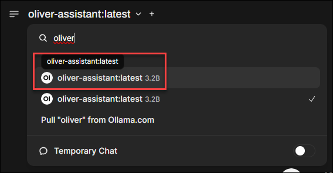
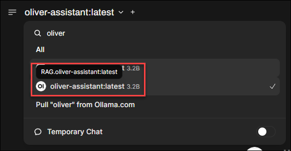

# Ollama Personal Assistant with RAG

A turn-key solution for creating a customized AI Personal Assistant with an Ollama-compatible RAG API. This project combines large language models with your personal information to deliver contextually relevant, personalized responses.

## Table of Contents

- [Ollama Personal Assistant with RAG](#ollama-personal-assistant-with-rag)
  - [Table of Contents](#table-of-contents)
  - [Overview](#overview)
  - [Key Features](#key-features)
  - [Getting Started](#getting-started)
    - [Prerequisites](#prerequisites)
    - [Basic Setup](#basic-setup)
  - [Project Structure](#project-structure)
  - [Using the Personal Assistant](#using-the-personal-assistant)
    - [Interactive CLI](#interactive-cli)
    - [API Access](#api-access)
    - [OpenWebUI Integration](#openwebui-integration)
  - [Docker Support](#docker-support)
  - [Advanced Topics](#advanced-topics)
    - [Customizing the Markdown Generation](#customizing-the-markdown-generation)
    - [Extending Dynamic Data Sources](#extending-dynamic-data-sources)
    - [Fine-tuning RAG Parameters](#fine-tuning-rag-parameters)
  - [Technical Details](#technical-details)
    - [What is RAG?](#what-is-rag)
    - [System Architecture](#system-architecture)
    - [Custom LLM vs. RAG System Prompt](#custom-llm-vs-rag-system-prompt)

## Overview

This project provides a complete solution for creating a personalized AI assistant powered by [Ollama](https://ollama.com) models and enhanced with Retrieval Augmented Generation (RAG). It enables your AI assistant to know and recall information about you, providing responses that feel natural and personalized.

The system combines:

1. **Personality & Formatting**: Customize an existing LLM to add a specific personality and response style.
2. **Static Personal Data**: Incorporate persistent information about your life: family, health, work, etc.
3. **Dynamic Data**: Include frequently changing information like weather forecasts, calendar events, and messages.

> [!NOTE]
> This project uses an example assistant named OLIVER (Overly Logical Interface with Vaguely Eccentric Replies) as a template. Feel free to customize it according to your preferences.
>
> 

## Key Features

- **Custom LLM Personality**: Define exactly how your assistant responds and presents information
- **Structured Data Management**: Separate static and dynamic personal information
- **API Compatibility**: Use with any Ollama-compatible client, including OpenWebUI
- **Interactive CLI**: Test and use the assistant directly from your terminal
- **Docker Support**: Deploy and run in containers for better isolation and portability
- **Modular Design**: Easily extend or modify components to fit your needs

## Getting Started

Follow these steps to set up your personal assistant:

### Prerequisites

- [Ollama](https://ollama.com) installed locally or on a remote server
- Python 3.10+ installed
- Git for cloning the repository

### Basic Setup

1. Clone the repository and set up the environment:

```bash
# Clone the repository
git clone https://github.com/robertsinfosec/ollama-personal-assistant-rag.git

# Change to the project directory
cd ollama-personal-assistant-rag/src

# Create a Python virtual environment and activate it
python -m venv .venv
source .venv/bin/activate  # On Windows use: .\.venv\Scripts\Activate.ps1

# Install the required dependencies
pip install -r src/requirements.txt
```

2. Customize your personal data by editing the YAML files:

```bash
# Edit static information
cd src/data/static/
# Edit files like owner.yaml, family.yaml, etc.

# Edit dynamic information
cd ../dynamic/
# Edit files like calendar.yaml, weather.yaml, etc.
# TODO: Create scripts that dynamically update these files
```

3. Generate the knowledge base document:

```bash
cd ../../  # Return to src directory
python main.py generate
```

> [!NOTE]
> This process takes all of the YAML files and Jinja2 templates in the `data/` directory and generates one, large markdown document called `personal_info.md`. This document serves as the knowledge base for your assistant.

4. Create your custom Ollama model:

On the Ollama server (if this isn't your local workstation), create a custom model using the Modelfile provided in the `models/` directory, then run:

```bash
python main.py create-model --name oliver-assistant --modelfile models/Modelfile
```

5. Start the API server:

```bash
python main.py api
```

This will start the FastAPI server, which listens for incoming requests on port 8901 by default. This server will look and act like an Ollama server, in that it will reflect all of the models that are available on the Ollama server, but it will also have a `/query` endpoint that will allow you to query the RAG system directly.

For detailed setup instructions, see the [src/README.md](./src/README.md).

## Project Structure

The project is organized into several key modules:

- **[api](./src/api/)**: FastAPI implementation of the RAG-enhanced API server
- **[config](./src/config/)**: Configuration settings for RAG and template generation
- **[data](./src/data/)**: YAML data files and Jinja2 templates for personal information
- **[generation](./src/generation/)**: Tools for generating the markdown knowledge base
- **[models](./src/models/)**: Ollama Modelfiles for customizing the assistant's personality
- **[rag](./src/rag/)**: Core RAG functionality for context retrieval and response enhancement

Each module has its own README with detailed documentation.

## Using the Personal Assistant

### Interactive CLI

Use the interactive CLI for direct conversations and testing:

```bash
cd src
python main.py interactive
```

For more context information, use verbose mode:

```bash
python main.py interactive --verbose
```

Available commands in the interactive CLI:
- `/help` - Show available commands
- `/context` - Toggle display of retrieved context
- `/clear_history` - Clear conversation history
- `/params` - Show current parameters
- `/model MODEL` - Change the model
- `/reload` - Reload the vector store

### API Access

The API server runs on port 8901 by default:

```bash
cd src
python main.py api
```

Access the API endpoints:
- `POST /api/chat` - Ollama-compatible chat API
- `POST /query` - Direct RAG query endpoint
- `GET /models` - List available models
- `POST /reload` - Reload the vector store

For complete API documentation, see [src/api/README.md](./src/api/README.md).

### OpenWebUI Integration

Connect OpenWebUI to your RAG-enhanced assistant:

1. In OpenWebUI under `/admin/settings`, go to the Connections tab
2. Click the `+` next to "Manage Ollama API Connections" 
3. Add a new connection with these settings:
   - URL: `http://[YOUR_API_HOST]:8901`
   - Prefix ID: `RAG` (or whatever you prefer)
   - "Add Model Id" field: `oliver-assistant`
4. Click `Save`

> [!IMPORTANT]
> The `RAG` prefix differentiates models that come from your RAG endpoint versus local models on the Ollama server:
>  
> 
>
> 

## Docker Support

Run the personal assistant in a Docker container:

```bash
cd src
docker build -t ollama-assistant:latest .
docker run -d --name oliver-assistant -p 8901:8901 ollama-assistant:latest
```

For detailed Docker instructions, see [src/DOCKER.md](./src/DOCKER.md).

## Advanced Topics

### Customizing the Markdown Generation

The system uses Jinja2 templates to transform YAML data into the final markdown document. You can customize this process by:

1. Editing the templates in `src/data/templates/`
2. Modifying the section mappings in `src/config/template_config.py`
3. Re-running `python main.py generate`

For template details, see [src/generation/README.md](./src/generation/README.md).

### Extending Dynamic Data Sources

To add new dynamic data sources:

1. Create a new YAML file in `src/data/dynamic/`
2. Create a corresponding Jinja2 template in `src/data/templates/`
3. Add the new mapping to `src/config/template_config.py`
4. Update your data collection scripts to maintain the YAML file

Consider setting up automated updates for dynamic data using cron jobs or scheduled tasks.

### Fine-tuning RAG Parameters

Adjust RAG parameters in `src/config/rag_config.py`:
- `DEFAULT_CHUNK_SIZE` and `DEFAULT_CHUNK_OVERLAP` control document chunking
- `DEFAULT_TOP_K` sets how many context chunks to retrieve
- `DEFAULT_TEMPERATURE` affects response creativity vs. coherence

## Technical Details

### What is RAG?

Retrieval Augmented Generation (RAG) combines a retrieval mechanism with a generative language model:

1. Your personal information is transformed into vector embeddings and stored in a vector database
2. When you ask a question, the system:
   - Converts your question to a vector
   - Finds the most relevant chunks of your personal information
   - Provides those chunks as context to the LLM
   - Generates a response using this personalized context

This approach allows the assistant to reference your personal information without it being part of the model's training data.

### System Architecture

The RAG workflow for a typical request:

1. **Query Processing**: Your question is vectorized using the Ollama model's embedding capabilities
2. **Retrieval**: The FAISS vector store finds relevant chunks from your personal information
3. **Context Integration**: Retrieved information is formatted into a prompt with conversation history
4. **Response Generation**: The Ollama model generates a personalized response using the enhanced context
5. **Conversation Management**: The exchange is added to conversation history for future context

### Custom LLM vs. RAG System Prompt

There are two ways to define your assistant's personality:

1. **Custom Ollama Model (current approach)**: Personality is defined at the model level via the Modelfile
   - Pros: Consistent personality across interfaces
   - Cons: Requires model rebuilds for personality changes

2. **Generic LLM + RAG System Prompt**: Personality is injected via the RAG prompt
   - Pros: More flexibility for personality changes
   - Pros: Model-agnostic (works with any LLM)

The current implementation uses option 1, but the code could be modified to support both approaches.